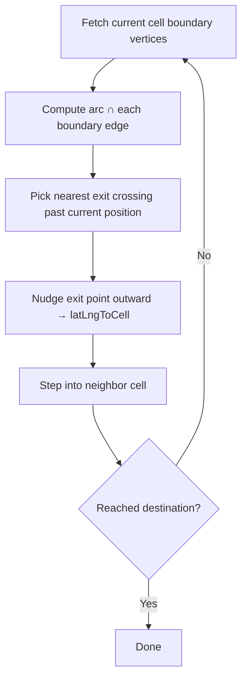
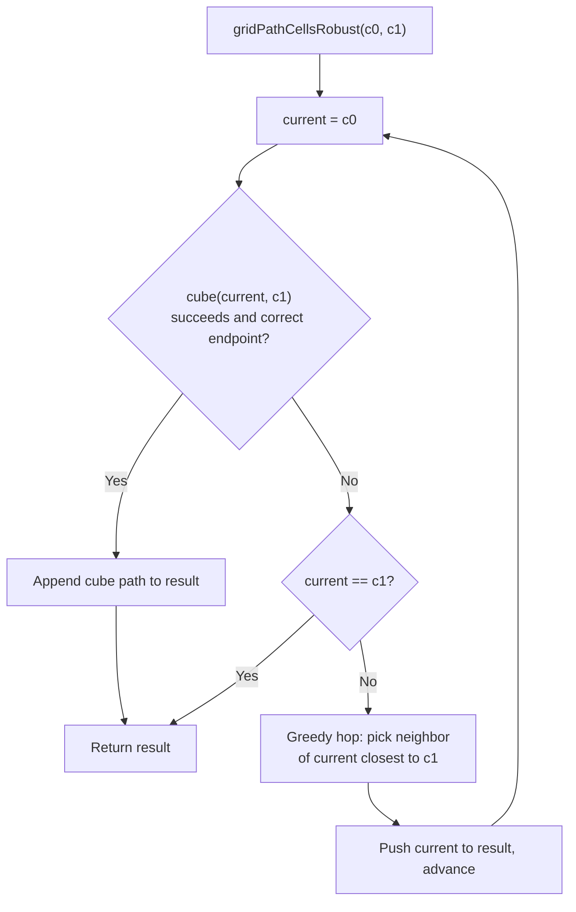
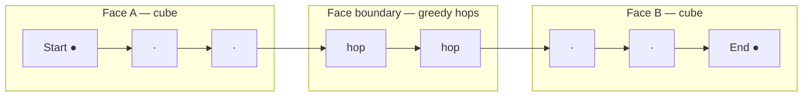

# Extensions

`FastH3.FastH3Extension` provides alternative `gridPathCells` implementations
that complement the core H3 cube-interpolation algorithm. All functions live in
the `FastH3Extension` submodule and must be accessed with a qualified name:

```julia
import FastH3
path = FastH3.FastH3Extension.gridPathCells(c0, c1)
```

## Algorithm Comparison

FastH3 ships three path algorithms in the core module and extension, plus
[`FastH3.FastH3Extension.gridDistanceRobust`](@ref) for hop counts along the
robust path. They differ in algorithm, robustness, speed, and the semantic
meaning of the path they return.

### `FastH3.gridPathCells` — Cube Interpolation

The standard H3 algorithm. It maps both endpoints into a shared local IJ
coordinate system, computes `gridDistance`, and linearly interpolates in cube
coordinates. Each interpolated point is rounded to the nearest cell.

The path follows a straight line in IJK coordinate space, which does not
correspond to the geographic great circle on the sphere:


The cube path takes the shortest route through the hex grid (minimum hops).
Cells that the great-circle arc would cross but that lie off the IJK line
are not included.

| Property | Value |
|:--|:--|
| **Path length** | Exactly `gridDistance + 1` cells (the shortest grid path). |
| **Path meaning** | Follows the IJK coordinate grid, not the geographic great circle. |
| **Speed** | Very fast — a single allocation and O(n) integer arithmetic. |
| **Robustness** | Returns `E_DOMAIN` when start and end lie on different icosahedral faces that cannot share a local IJ coordinate system. Can also silently produce incorrect endpoints for certain cross-face pairs where `gridDistance` succeeds but the IJ mapping is inaccurate. |

```julia
err, path = FastH3.gridPathCells(c0, c1)
# err may be E_DOMAIN for cross-face paths
```

### `FastH3.FastH3Extension.gridPathCells` — Great-Circle Walk

An analytic walk along the geographic great-circle arc connecting the two cell
centres. At each cell it computes the intersection of the great-circle arc with
every boundary edge, steps into the neighbor on the far side of the nearest
exit edge, and repeats. A bisection fallback handles degenerate cases (e.g. the
arc grazing a hex vertex).

The path follows the great-circle arc on the sphere and includes every cell
whose boundary it crosses, even corner cells that the shortest grid path would
skip:


The step-by-step walk works as follows:



| Property | Value |
|:--|:--|
| **Path length** | Variable — includes every cell whose boundary the arc crosses. May be longer than `gridDistance + 1` because the arc can clip corner cells that the shortest grid path would skip. |
| **Path meaning** | Geographically faithful: the path follows the great-circle arc on the sphere. |
| **Speed** | Slower — each step requires trigonometric intersection tests against up to 6 boundary edges plus `latLngToCell` lookups. Roughly 10–25x slower than cube interpolation. |
| **Robustness** | Always succeeds, including across icosahedral face boundaries and near pentagons. |

```julia
path = FastH3.FastH3Extension.gridPathCells(c0, c1)
# always returns a valid path
```

A callback form is also available for zero-allocation iteration:

```julia
FastH3.FastH3Extension.gridPathCells!(c0, c1) do cell
    # process each H3Index
end
```

### `FastH3.FastH3Extension.gridPathCellsRobust` — Cube with Greedy Re-Anchoring

A surgical fix for the cube algorithm's cross-face limitation. It keeps the
cube interpolation algorithm intact but, when a step fails at a face boundary,
performs a single greedy neighbor hop toward the target and re-anchors the
cube coordinate system from the new cell.

The algorithm:



For cross-face paths, cube handles the same-face segments while greedy hops
bridge the face boundary:



Each greedy hop is O(1): `gridDisk(current, 1)` gives 7 cells, pick the one
with minimum `greatCircleDistanceRads` to the target. No SLERP, no
great-circle intersection math, no recursion.

| Property | Value |
|:--|:--|
| **Path length** | Close to `gridDistance + 1`. Within each face, produces the shortest grid path. At boundaries, the greedy hop picks the geographically closest neighbor. |
| **Path meaning** | Closest to what cube interpolation would produce if the IJ coordinate system worked across faces. |
| **Speed** | Same-face: identical to cube (single call, no overhead). Cross-face: greedy hops at O(1) per hop, then cube for the remainder. |
| **Robustness** | Always succeeds — greedy geographic hops bridge any face boundary. |

```julia
path = FastH3.FastH3Extension.gridPathCellsRobust(c0, c1)
# always returns a valid path
```

## Summary Table

| | Cube | Great-Circle Walk | Robust |
|:--|:--|:--|:--|
| **Function** | `FastH3.gridPathCells` | `FastH3.FastH3Extension.gridPathCells` | `FastH3.FastH3Extension.gridPathCellsRobust` |
| **Returns** | `(H3Error, Vector{H3Index})` | `Vector{H3Index}` | `Vector{H3Index}` |
| **Always succeeds** | No | Yes | Yes |
| **Shortest path** | Yes (when it works) | No | Approximately (greedy at boundaries) |
| **Follows great circle** | No | Yes | No |
| **Cross-face** | Fails or wrong result | Works | Works |
| **Relative speed** | 1x | 10–25x slower | ~1x same-face, fast cross-face |

## When to Use Which

- **Same-face, performance-critical**: Use `FastH3.gridPathCells`. It is the
  fastest option and produces the shortest grid path, but only when both cells
  share an icosahedral face.
- **Need the geographic great-circle path**: Use
  `FastH3.FastH3Extension.gridPathCells`. It faithfully traces the spherical
  arc, which matters for applications like line-of-sight, coverage analysis, or
  trajectory mapping where the physical path on the globe is significant.
- **Robust drop-in replacement for cube**: Use
  `FastH3.FastH3Extension.gridPathCellsRobust`. It produces the same path as
  cube interpolation for same-face paths and surgically bridges face boundaries
  with greedy hops. The simplest robust option with minimal algorithmic
  complexity. Use [`FastH3.FastH3Extension.gridDistanceRobust`](@ref) for the
  hop count along that path.

## API Reference

```@docs
FastH3.FastH3Extension.gridPathCells!
FastH3.FastH3Extension.gridPathCells
FastH3.FastH3Extension.gridPathCellsRobust
FastH3.FastH3Extension.gridDistanceRobust
```
